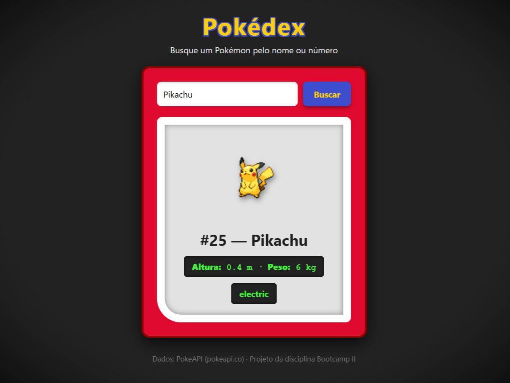

<div align="center">
  
  <h1>Pokédex — Bootcamp II 🔴⚪</h1>
  <p>Uma aplicação web responsiva e interativa que simula uma Pokédex clássica, consumindo dados diretamente da <b>PokeAPI</b>.</p>

  <p>
    <a href="https://luc4s2744.github.io/Entrega_Inicial_Bootcamp_II/">🌍 Acessar o Site</a> •
    <a href="https://github.com/luc4s2744/Entrega_Inicial_Bootcamp_II">💻 Ver Repositório</a>
  </p>

  <p>
    
    
    
  </p>
</div>

## 📖 Sobre o Projeto

Este projeto foi desenvolvido como parte da disciplina **Bootcamp II**. O objetivo principal foi criar uma interface clássica de Pokédex que consome a [PokeAPI](https://pokeapi.co/), permitindo a busca dinâmica de Pokémon por nome ou número (ID). Todo o design foi elaborado com CSS puro para remeter ao icônico aparelho vermelho, enquanto o JavaScript lida com o consumo assíncrono de dados da API.

Construir este projeto faz parte da minha jornada de desenvolvimento e preparação de portfólio. Ele é fundamental para demonstrar minhas habilidades práticas, raciocínio lógico e dedicação, estruturando uma base sólida para conquistar minhas primeiras oportunidades na área de tecnologia, como uma posição de Jovem Aprendiz.

## ✨ Funcionalidades

- 🔍 **Busca Dinâmica:** Encontre qualquer Pokémon pelo seu nome ou número de registro.
- 🎨 **Design Nostálgico:** Interface estilizada simulando a Pokédex clássica, com paleta de cores característica, bordas arredondadas e tela com estética retrô.
- ⚡ **Consumo de API:** Requisições assíncronas utilizando `fetch` no JavaScript, acompanhadas de tratamento de erros (feedback amigável caso o Pokémon não seja encontrado).
- 📊 **Exibição de Dados:** Renderização em tempo real de informações como sprite (imagem), tipo(s), altura, peso e ID.

## 🚀 Tecnologias Utilizadas

- **HTML5:** Estruturação semântica da página e organização do conteúdo.
- **CSS3:** Estilização avançada, layout Flexbox, aplicação de sombras (`box-shadow`), filtros de imagem e responsividade.
- **JavaScript (Vanilla):** Manipulação do DOM (`innerHTML`, `getElementById`), escuta de eventos (tecla Enter e clique), e integração com a PokeAPI utilizando funções assíncronas (`async/await` e `try/catch`).

## 🎮 Como Testar Localmente

1. Clone este repositório em sua máquina:
   ```bash
   git clone https://github.com/luc4s2744/Entrega_Inicial_Bootcamp_II
   ```
2. Navegue até a pasta do projeto:
   ```bash
   cd Entrega_Inicial_Bootcamp_II
   ```
3. Abra o arquivo `index.html` no seu navegador de preferência, ou utilize a extensão *Live Server* no VS Code para uma melhor experiência.

## 📸 Prévia

<div align="center">
  
</div>

---
<div align="center">
  Feito com dedicação para o Bootcamp II 🚀
</div>